## 

:::: {.columns}
::: {.column style="width:30%; font-size:0.5em;"}
```
Download hsbc data here: https://data-browser.hbsc.org/wp-content/uploads/csvs/data.csv  and meta data here https://data-browser.hbsc.org/wp-content/uploads/csvs/metadata.csv.
Then extract data for 15 year olds
- who-5-well-being-index
- life satisfaction
- self efficacy (2 measures)
from the data and calculate a composite score for each country.

Next go to https://zenodo.org/records/13382904 and download the PISA 2022 student file.
Build a composite score from reading, mathematics and science, and compute the average for each European country.

Finally, plot a scatterplot with the composite HBSC score on the x-axis and the composite PISA score on the y-axis. Label all the Nordic countries and highlight Norway and save the figure as figures/scatter_pisa_hsbc.png

Use R to do this.
Document all steps in a script, which you save as scripts/pisa_hbsc_scatter.
Save all data in the data folder.
```
:::
::: {.column width="70%"}
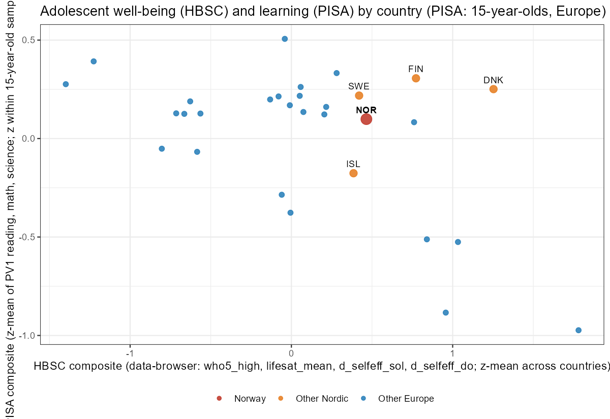{width=100% fig-align="center"}
:::
::::


## LLM-problemer for forskere

* LLM-er er **prediksjons-/interpolasjonsmaskiner**: De modellerer den temporale rekkefølgen til tokens (ord)
* Dette er **svært nyttig**, fordi riktig ordnede ord faktisk inneholder mening
* Men måten LLM-er er bygget på skaper 2 problemer for forskere når «nye» ordrekker genereres
  * **Regresjon mot modalverdien** i treningsdataene
  * **Hallusinasjon**

Som forskere ønsker vi å utnytte nytten av LLM-er samtidig som vi kontrollerer problemene deres

---

## Løsninger på LLM-problemer

* Aktiver **utvidet resonnering** for komplekse spørsmål^[Kalles «tenkemodus», «dyp forskning» osv. avhengig av leverandør]
* Gode **egendefinerte instruksjoner**
* Gode **spørringer** (prompts)
* Fyll **kontekstvinduene** med relevant informasjon
* Bruk verktøy med **innebygd verifisering**
* **Be LLM-er bare om å gjøre arbeid du kan verifisere**^[LLM-er multipliserer kompetansen du har, de gir ikke helt nye kompetanser.]
* **Datapersonvern**: se [blogginnlegget](AI4Research_blog_no.html)

---

## Egendefinerte instruksjoner

:::: {.columns}

::: {.column width="60%"}
* Alle modeller lar deg **endre personligheten**
* Gjelder **alle samtaler** — sett én gang, alltid aktiv
* Instruksjoner for forskere
:::

::: {.column width="40%"}
<div id="ci-wrap-instructions" style="width:100%;">
  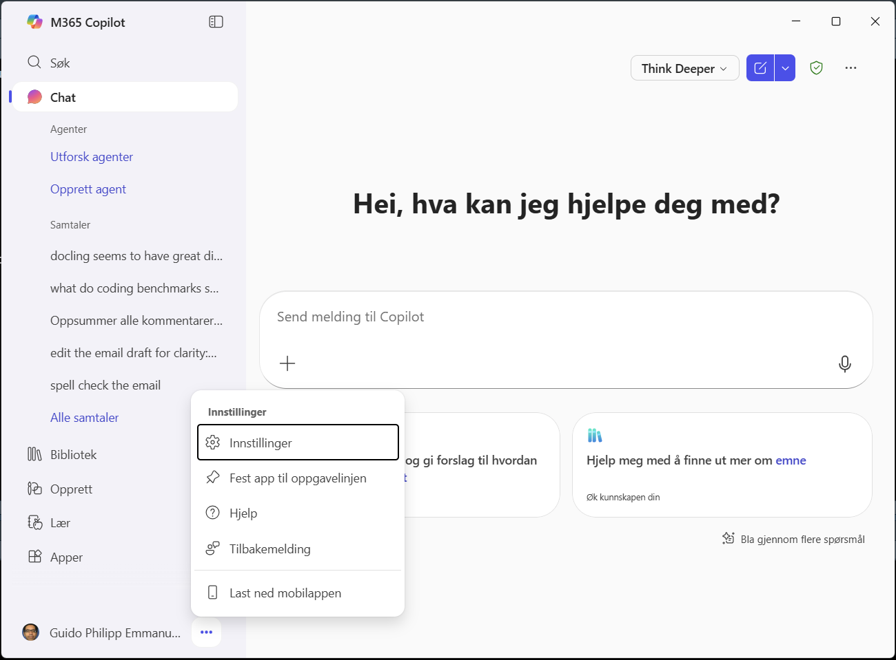
  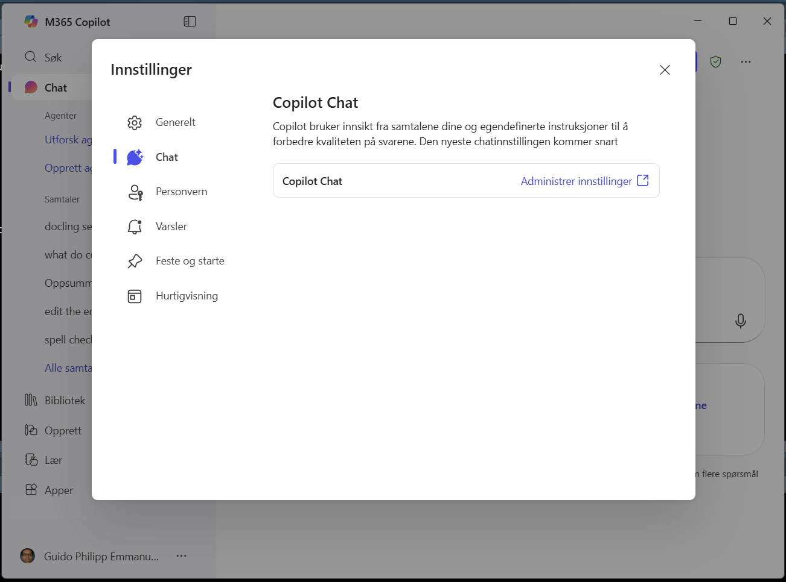
  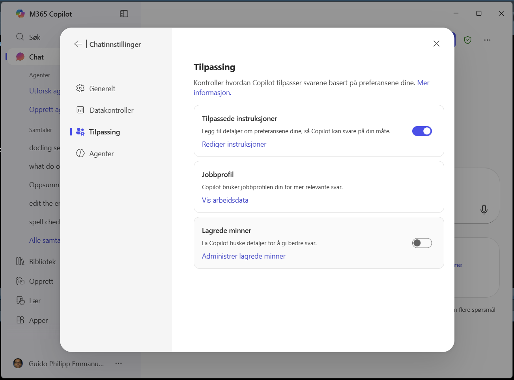
  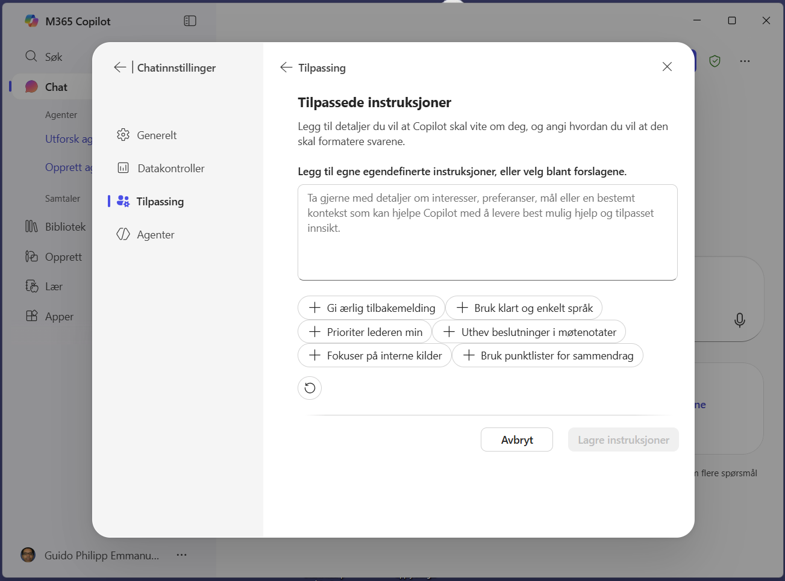
</div>
<div id="ci-caption-instructions" style="text-align:center;font-size:0.8em;color:#555;">1 / 4</div>
<script>
(function(){
  var wrap = document.getElementById('ci-wrap-instructions');
  var slides = wrap.querySelectorAll('img');
  var cap = document.getElementById('ci-caption-instructions');
  var n = slides.length;
  var i = 0;
  setInterval(function(){
    slides[i].style.display = 'none';
    i = (i+1) % n;
    slides[i].style.display = 'block';
    cap.textContent = (i+1) + " / " + n;
  }, 3000);
})();
</script>
:::

::::

> - **Say "I don't know"** rather than guessing; never fabricate citations or statistics
> - **Use tools** like web search or python to verify facts before stating them
> - **Push back** on flawed reasoning or unsupported claims
> - **Think step by step** and check your reasoning before answering
> - **Cite primary literature**; prefer peer-reviewed sources over summaries
> - **Read papers critically**: flag when conclusions outrun the evidence, when study designs cannot support causal claims, or when limitations are understated
> - **Be concise**; do not pad responses or ask unnecessary follow-up questions
> - Do not suggest next steps or offer further help unless asked

## Tilpassede chatboter

:::: {.columns}

::: {.column width="50%"}
* Definer og bruk oppgavespesifikke chatboter
* Gi ytterligere informasjon om ønsket atferd
* Eksempler:
  * Metodekonsulent, kopiredaktør engelsk, søknadsrådgiver, kopiredaktør «enkelt språk»
:::

::: {.column width="40%"}
<div id="ci-wrap-chats" style="width:100%;">
  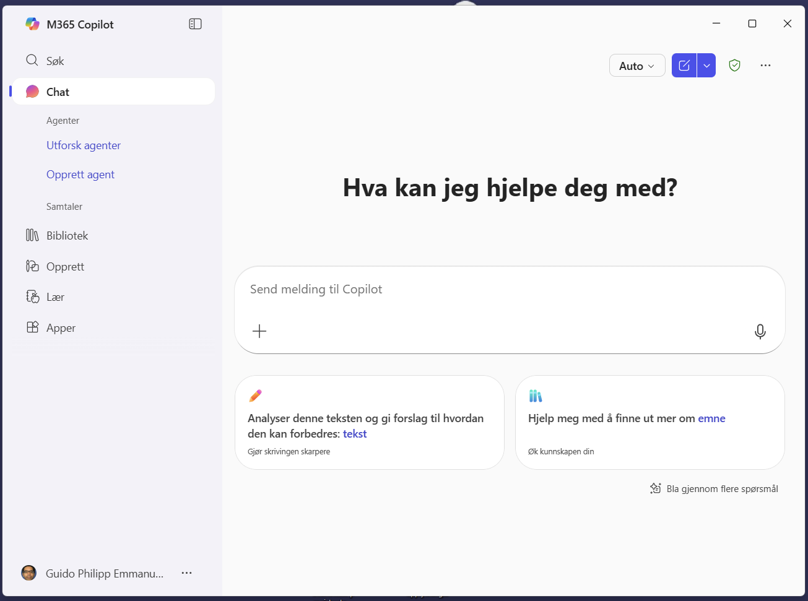
  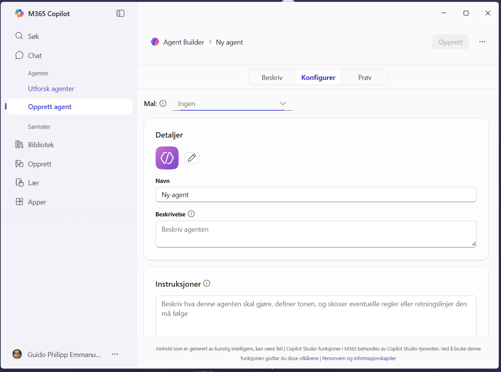
  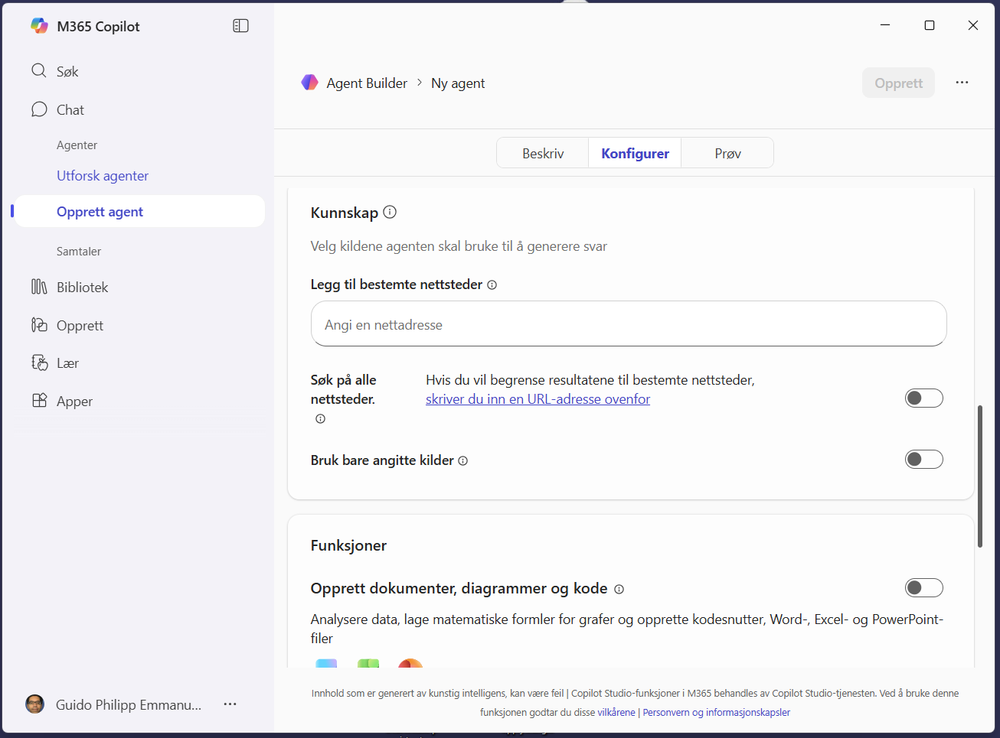
</div>
<div id="ci-caption-chats" style="text-align:center;font-size:0.8em;color:#555;">1 / 3</div>
<script>
(function(){
  var wrap = document.getElementById('ci-wrap-chats');
  var slides = wrap.querySelectorAll('img');
  var cap = document.getElementById('ci-caption-chats');
  var n = slides.length;
  var i = 0;
  setInterval(function(){
    slides[i].style.display = 'none';
    i = (i+1) % n;
    slides[i].style.display = 'block';
    cap.textContent = (i+1) + " / " + n;
  }, 3000);
})();
</script>
:::

::::


Chatbot-innhold

:::: {.columns}

::: {.column width="30%"}
* Navn
* Beskrivelse
:::

::: {.column width="30%"}
* **Instruksjoner**
* **Kunnskap**
:::

::: {.column width="30%"}
* Verktøy
:::

::::


## Retrieval Augmented Generation

:::: {.columns}

::: {.column width="60%"}
* Begrenser svar til relevant tekst fra de oppgitte dokumentene
* Bruker semantisk søk for å finne relevant tekst i en kunnskapsbase
:::

::: {.column width="40%"}
<div id="ci-wrap-notebooklm" style="width:100%;">
  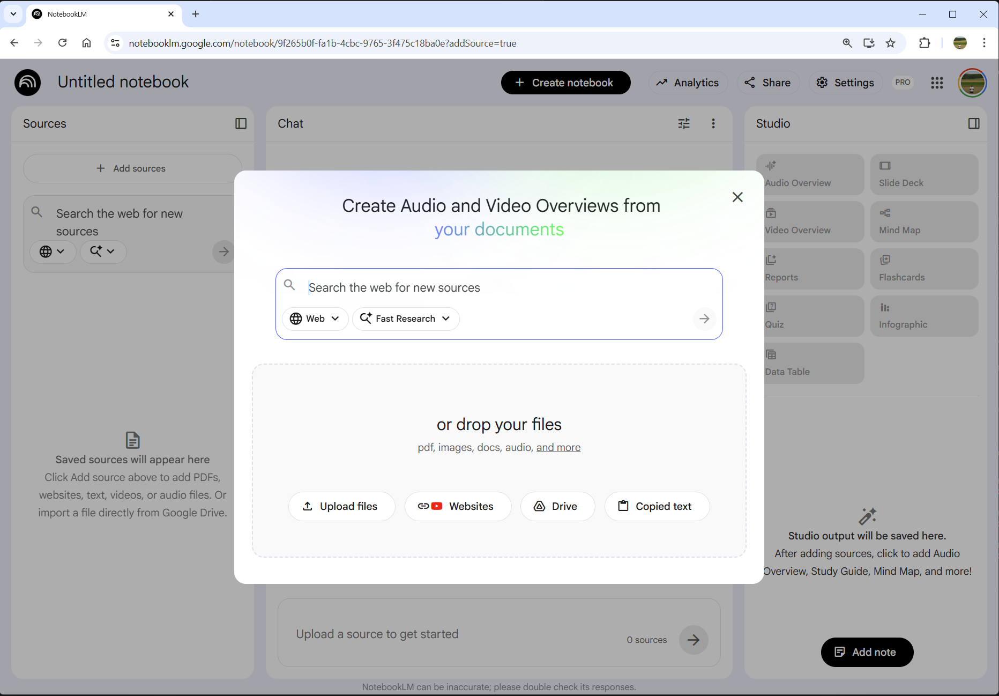
  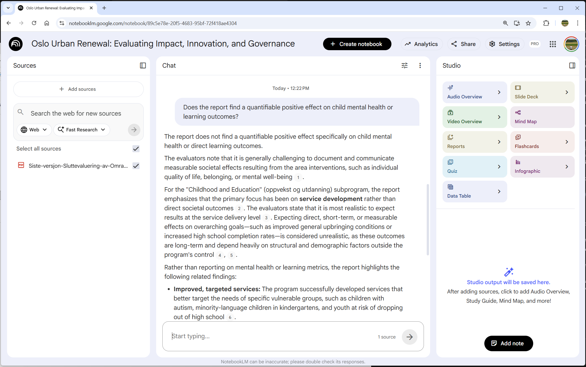
  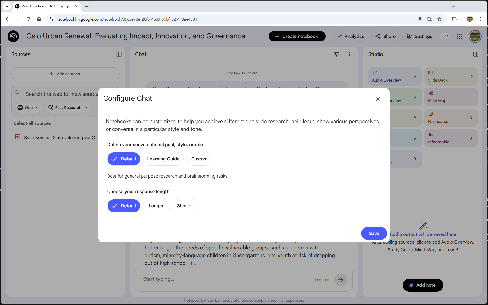
</div>
<div id="ci-caption-notebooklm" style="text-align:center;font-size:0.8em;color:#555;">1 / 3</div>
<script>
(function(){
  var wrap = document.getElementById('ci-wrap-notebooklm');
  var slides = wrap.querySelectorAll('img');
  var cap = document.getElementById('ci-caption-notebooklm');
  var n = slides.length;
  var i = 0;
  setInterval(function(){
    slides[i].style.display = 'none';
    i = (i+1) % n;
    slides[i].style.display = 'block';
    cap.textContent = (i+1) + " / " + n;
  }, 3000);
})();
</script>
:::
::::

  * **Elicit** (elicit.com, flott men bruker mest sammendrag)
  * **NotebookLM** (https://notebooklm.google.com/)
* Også her: Søppel inn, søppel ut. (`pdfParser` i R)


## Tekstgenerering med verifisering

* Rapporter for hundrevis av kommuner, skoler, ... — å skrive undergruppespecifik tekst for hånd skalerer ikke
* LLM-er kan generere denne teksten automatisk fra statistiske tabeller
* Også nyttig for å utarbeide resultatdeler fra analyseresultater
* Risiko: Hallusinasjon av tall: **programmatisk verifisering**
* I R: `tblscribe`^[sammenligner tall i generert tekst mot kildetabellen]

## Agentbaserte systemer

:::: {.columns}

::: {.column width="80%"}
  * Planlegger og gjennomfører flertrinnsoppgaver med minimal input.
  * Kan bruke eksterne verktøy: nettsøk, filsystem, databaser og API-er.
  * **Skriver og kjører kode.**
  * Arbeider iterativt — kjører kode, leser feil og **korrigerer seg selv**.
  * Mest effektivt når du kan vurdere om resultatet er korrekt.

:::

::: {.column style="width:20%; font-size:0.5em;"}
  * cursor.com
  * anthropic.com/product/claude-code
  * anthropic.com/product/claude-cowork
  * https://antigravity.google/
  * ...

:::

::::

## Oppsummering

* LLM-er er ekstremt kraftige, men også feilbarlige
* Trenger sikkerhetstiltak: Egendefinerte instruksjoner, tilpassede chatboter, RAG, programmatisk verifisering
* Agentbaserte systemer er neste steg
* LLM-er multipliserer kompetansene du allerede har

**Vi blir stadig bedt om å produsere relevant forskning — raskt. KI-verktøyene for dette finnes. Det vi trenger nå, er å lære å bruke dem godt.**

