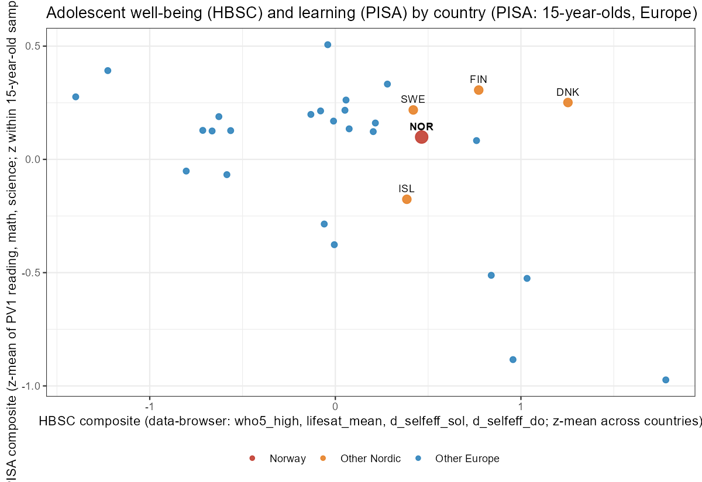
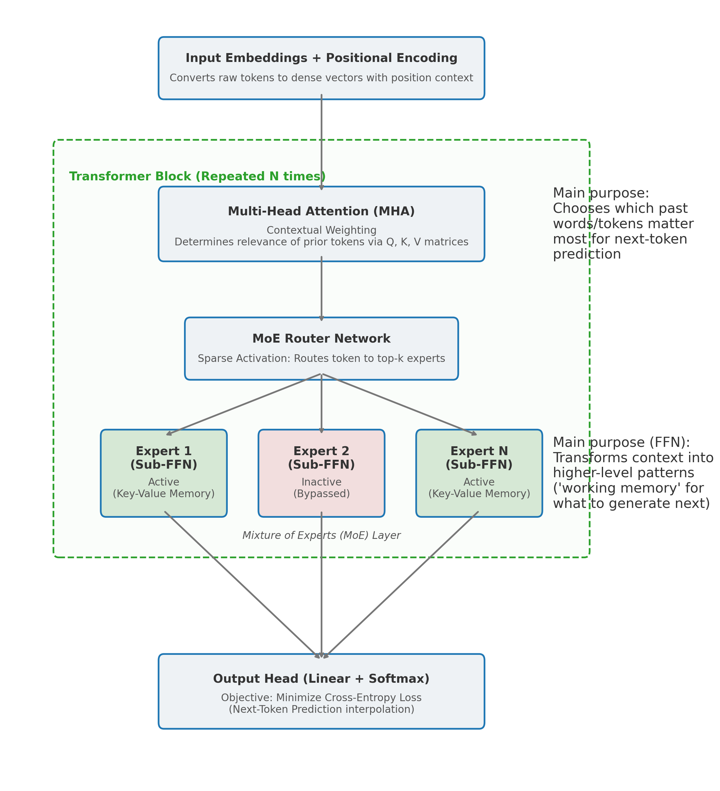
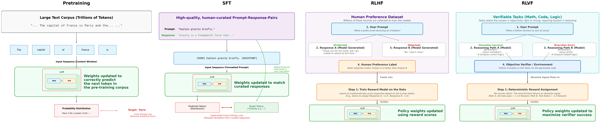
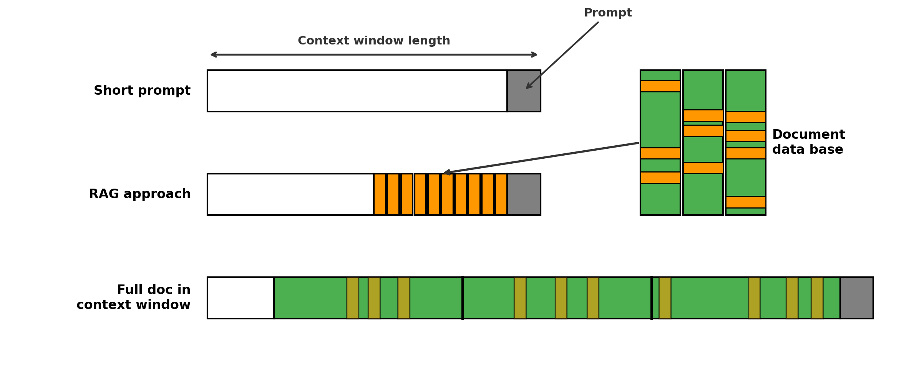

## 

:::: {.columns}
::: {.column style="width:30%; font-size:0.5em;"}
```{.markdown}
Download hsbc data here: https://data-browser.hbsc.org/wp-content/uploads/csvs/data.csv  and meta data here https://data-browser.hbsc.org/wp-content/uploads/csvs/metadata.csv.
Then extract data for 15 year olds
- who-5-well-being-index
- life satisfaction
- self efficacy (2 measures)
from the data and calculate a composite score for each country.

Next go to https://zenodo.org/records/13382904 and download the PISA 2022 student file.
Build a composite score from reading, mathematics and science, and compute the average for each European country.

Finally, plot a scatterplot with the composite HBSC score on the x-axis and the composite PISA score on the y-axis. Label all the Nordic countries and highlight Norway and save the figure as figures/scatter_pisa_hsbc.png

Use R to do this.
Document all steps in a script, which you save as scripts/pisa_hbsc_scatter.
Save all data in the data folder.
```
:::
::: {.column width="70%"}
{width=100% fig-align="center"}
:::
::::


## LLM-problemer for forskere

* LLM-er er **prediksjons-/interpolasjonsmaskiner**: De modellerer den temporale rekkefølgen til tokens (ord)
* Dette er **svært nyttig**, fordi riktig ordnede ord faktisk inneholder mening
* Men måten LLM-er er bygget på skaper 2 problemer for forskere når «nye» ordrekker genereres
  * **Regresjon mot modalverdien** i treningsdataene
  * **Hallusinasjon**

Som forskere ønsker vi å utnytte nytten av LLM-er samtidig som vi kontrollerer problemene deres

---

## LLM-arkitektur (høynivå)

{width=100% fig-align="center"}

---

## Hvordan trening oppdaterer modellen

{width=100% fig-align="center"}

---

## Oppsummering av treningssteg

::: {style="font-size:0.75em;"}
| Steg | Data | Treningsmål | Feilmodus |
|---|---|---|---|
| Pretraining | Stort neste-token-korpus (web, bøker, kode) | Minimer neste-token-tap | Regresjon mot modalverdien; arvet skjevhet fra korpus |
| SFT | Kuraterte prompt-respons-eksempler | Matche foretrukne assistent-svar | Overtilpasning til annoteringsstil; redusert variasjon |
| RLHF | Menneskelige preferansesammenligninger | Maksimer reward-model-score via RL | Reward hacking; preferansebias fra vurderere |
| RLVF | Verifiserbare oppgaver (tester, kompilatorer, sjekkere) | Maksimer objektiv verifikatorsuksess via RL | Optimaliserer mot sjekkeren, men kan bomme på bredere kvalitet |
:::

---

## Løsninger på LLM-problemer

* Aktiver **utvidet resonnering** for komplekse spørsmål^[Kalles «tenkemodus», «dyp forskning» osv. avhengig av leverandør]
* Gode **egendefinerte instruksjoner**
* Gode **spørringer** (prompts)
* Fyll **kontekstvinduene** med relevant informasjon
* Bruk verktøy med **innebygd verifisering**
* **Be LLM-er bare om å gjøre arbeid du kan verifisere**^[LLM-er multipliserer kompetansen du har, de gir ikke helt nye kompetanser.]
* **Datapersonvern**: se [blogginnlegget](AI4Research_blog_no.html)

---

## Utvidet resonnering

:::: {.columns}

::: {.column width="50%"}
* De fleste chatboter tilbyr en **utvidet resonneringsmodus**^[kalt «tenkemodus», «dyp forskning» e.l. avhengig av leverandør]
* Modellen arbeider steg for steg **før** den genererer svar
* Noen tjenester har **auto**-innstilling — for krevende oppgaver, velg høyere nivå eksplisitt
:::

::: {.column width="50%"}
<video autoplay loop muted playsinline width="100%" style="display: block; margin: 0 auto;" title="Utvidet resonnering i Copilot">
  <source src="figures/Thinking.mp4" type="video/mp4" />
</video>
:::

::::

## Egendefinerte instruksjoner

:::: {.columns}

::: {.column width="40%"}
* Alle modeller lar deg **endre personligheten**
* Gjelder **alle samtaler** — sett én gang, alltid aktiv
* Bør være **på engelsk**^[Fordi modeller følger engelske instruksjoner mer presist og konsekvent, selv når de svarer på norsk.]
:::

::: {.column width="60%"}
<video autoplay loop muted playsinline width="100%" style="display: block; margin: 0 auto;" title="Egendefinerte instruksjoner i Copilot">
  <source src="figures/CustomInstructions.mp4" type="video/mp4" />
</video>
:::

::::
  
## Fullstendig "Custom Instructions"

::: {style="font-size: 0.5em;"}
### Accuracy & Sourcing
* **Search Mandate:** Independently verify all empirical, volatile, or specific data (stats, roles, software, legal, academic) via web search. **Do not rely on training data for these.**
* **Academic Verification:** Provide direct URLs/DOIs. Verify author lists, journal names, and metrics against the published abstract before stating conclusions. 
* **Handling Uncertainty:** If a source cannot be confirmed or search is inconclusive, state so explicitly. Prefix empirical claims with "unverified:" if search is unavailable. 
* **Honesty:** Say "I don't know" instead of guessing. Never fabricate citations, statistics, or quotes.

### Critical Analysis
* **Step-by-Step Logic:** Employ chain-of-thought reasoning and self-correct before responding. 
* **Intellectual Pushback:** Objectively challenge flawed reasoning or unsupported claims in the prompt.
* **Research Review:** Flag when conclusions outrun evidence, study designs cannot support causal claims, or limitations are understated.

### Communication Constraints
* **Directness:** Omit all pleasantries, filler, and background context. Provide concise, fluff-free responses.
* **No Engagement Loops:** Do not ask follow-up questions, suggest next steps, or offer further help unless explicitly requested.
:::
## Markdown "Custom Instructions"
::: {style="font-size: 0.7em;"}
```{.markdown}
### Accuracy & Sourcing
* **Search Mandate:** Independently verify all empirical, volatile, or specific data (stats, roles, software, legal, academic) via web search. **Do not rely on training data for these.**
* **Academic Verification:** Provide direct URLs/DOIs. Verify author lists, journal names, and metrics against the published abstract before stating conclusions. 
* **Handling Uncertainty:** If a source cannot be confirmed or search is inconclusive, state so explicitly. Prefix empirical claims with "unverified:" if search is unavailable. 
* **Honesty:** Say "I don't know" instead of guessing. Never fabricate citations, statistics, or quotes.

### Critical Analysis
* **Step-by-Step Logic:** Employ chain-of-thought reasoning and self-correct before responding. 
* **Intellectual Pushback:** Objectively challenge flawed reasoning or unsupported claims in the prompt.
* **Research Review:** Flag when conclusions outrun evidence, study designs cannot support causal claims, or limitations are understated.

### Communication Constraints
* **Directness:** Omit all pleasantries, filler, and background context. Provide concise, fluff-free responses.
* **No Engagement Loops:** Do not ask follow-up questions, suggest next steps, or offer further help unless explicitly requested.
```
:::

## Tilpassede chatboter

:::: {.columns}

::: {.column width="50%"}
* Definer og bruk oppgavespesifikke chatboter
* Gi ytterligere informasjon om ønsket atferd
* Eksempler:
  * Metodekonsulent, kopiredaktør engelsk, søknadsrådgiver, kopiredaktør «enkelt språk»
:::

::: {.column width="50%"}
<video autoplay loop muted playsinline width="100%" style="display: block; margin: 0 auto;" title="Egendefinerte instruksjoner i Copilot">
  <source src="figures/CustomChatbot.mp4" type="video/mp4" />
</video>
:::

::::


Chatbot-innhold

:::: {.columns}

::: {.column width="30%"}
* Navn
* Beskrivelse
:::

::: {.column width="30%"}
* **Instruksjoner**
* **Kunnskap**
:::

::: {.column width="30%"}
* Verktøy
:::

::::

## Informasjon in kontekstvindu

{fig-alt="Visualization of context window utilization for short prompt, RAG, and full-document context" width=100%}

## Retrieval Augmented Generation

:::: {.columns}

::: {.column width="50%"}
* Begrenser svar til relevant tekst fra de oppgitte dokumentene
* Bruker semantisk søk for å finne relevant tekst i en kunnskapsbase
:::

::: {.column width="50%"}
<video autoplay loop muted playsinline width="100%" style="display: block; margin: 0 auto;" title="Egendefinerte instruksjoner i Copilot">
  <source src="figures/NotebookLM.mp4" type="video/mp4" />
</video>
:::
::::

  * **Elicit** (elicit.com, flott men bruker mest sammendrag)
  * **NotebookLM** (https://notebooklm.google.com/)
* Også her: Søppel inn, søppel ut. (`pdfParser` i R)


## Tekstgenerering med verifisering

* Rapporter for hundrevis av kommuner, skoler, ... — å skrive undergruppespecifik tekst for hånd skalerer ikke
* LLM-er kan generere denne teksten automatisk fra statistiske tabeller
* Også nyttig for å utarbeide resultatdeler fra analyseresultater
* Risiko: Hallusinasjon av tall: **programmatisk verifisering** ^[I R: `tblscribe`sammenligner tall i generert tekst mot kildetabellen]

## Agentbaserte systemer

:::: {.columns}

::: {.column width="80%"}
  * Planlegger og gjennomfører flertrinnsoppgaver med minimal input.
  * Kan bruke eksterne verktøy: nettsøk, filsystem, databaser og API-er.
  * **Skriver og kjører kode.**
  * Arbeider iterativt — kjører kode, leser feil og **korrigerer seg selv**.
  * Mest effektivt når du kan vurdere om resultatet er korrekt.

:::

::: {.column style="width:20%; font-size:0.5em;"}
  * cursor.com
  * anthropic.com/product/claude-code
  * anthropic.com/product/claude-cowork
  * https://antigravity.google/
  * ...

:::

::::

## Oppsummering

* LLM-er er ekstremt kraftige, men også feilbarlige
* Trenger sikkerhetstiltak: Egendefinerte instruksjoner, tilpassede chatboter, RAG, programmatisk verifisering
* Agentbaserte systemer er neste steg
* LLM-er multipliserer kompetansene du allerede har

**Vi blir stadig bedt om å produsere relevant forskning — raskt. KI-verktøyene for dette finnes. Det vi trenger nå, er å lære å bruke dem godt.**

